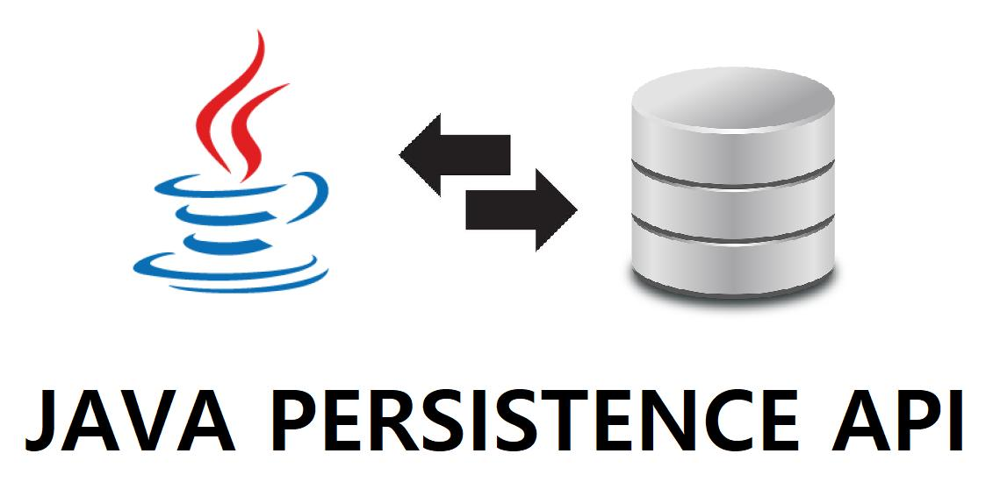

# Adressverwaltung

***
<div align="center">
	
	
	<p><b><em>JPA und JavaFX</em></b><br>Demonstration der Nutzung JPA und JavaFX</p>
</div>

***

## Voraussetzung

Installation einer <i>Oracle-Datenbank</i> und dem <i>SQL*Developer</i>:
<a href="https://github.com/mbeier1406/JavaFX#jdbc-beispiele">Anleitung</a>.

# Datenbankbenutzer einrichten

Zunächst den Datenbankbenutzer inklusive Schema für die Adressverwaltung anlegen. Verbinden:

```Shell
SQL> connect
```

Dann den Tablespace <code>av_tabspace</code> mit 10 MB Speicher (und <i>Autoextend</i>) für das Schema anlegen:

```Shell
SQL> create tablespace av_tabspace datafile 'av_tabspace.dat' size 10M autoextend on;
```

Den temporären Tablespace <code>av_tabspace_temp</code> anlegen. Der temporäre Tablespace ist der Ort, wo das
Datenbanksystem Daten ablegt, die nur für eine Session gültig sein sollen. Sollte es
einen Ausfall der Datenbank geben, so können die Daten von hier aus nicht mehr
wiederhergestellt werden.

```Shell
SQL> create temporary tablespace av_tabspace_temp tempfile 'av_tabspace_temp.dat' size 5M autoextend on;
```

Bei Oracle Versionen >= 12 folgendes Kommando eingeben:

```Shell
SQL> alter session set "_ORACLE_SCRIPT"=true;
```

Zuletzt den Datenbankbenutzer <code>av</code> anlegen und der Einfachheit halber alle Privilegien vergeben:

```Shell
SQL> create user av identified by geheim default tablespace av_tabspace temporary tablespace av_tabspace_temp;
SQL> grant all privileges to av;
```
