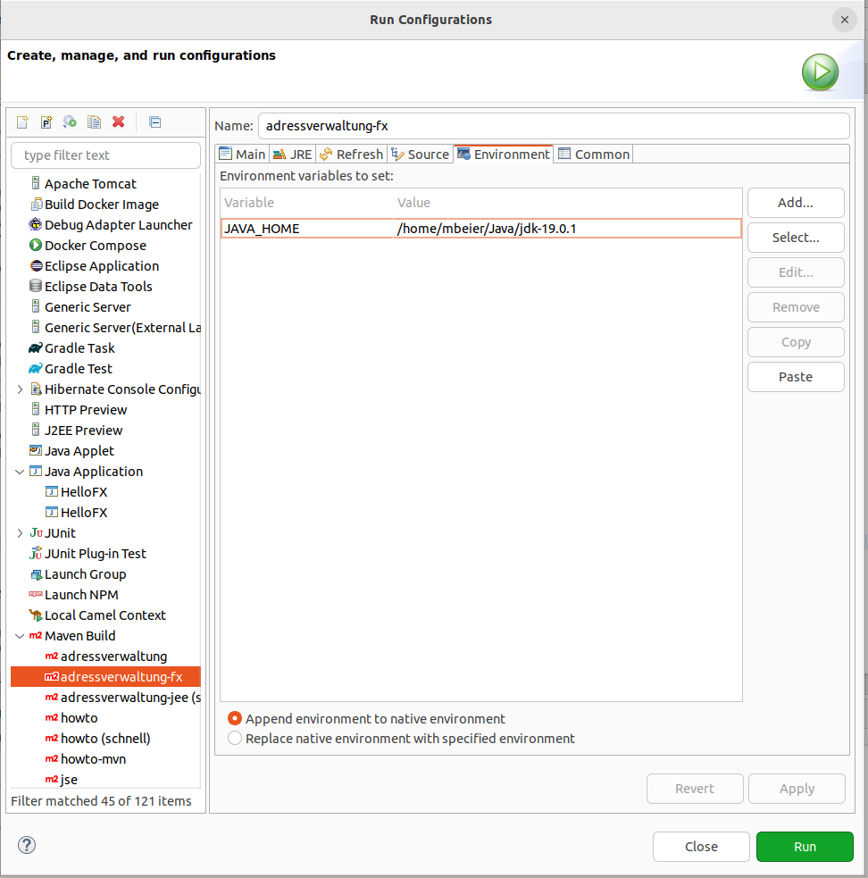
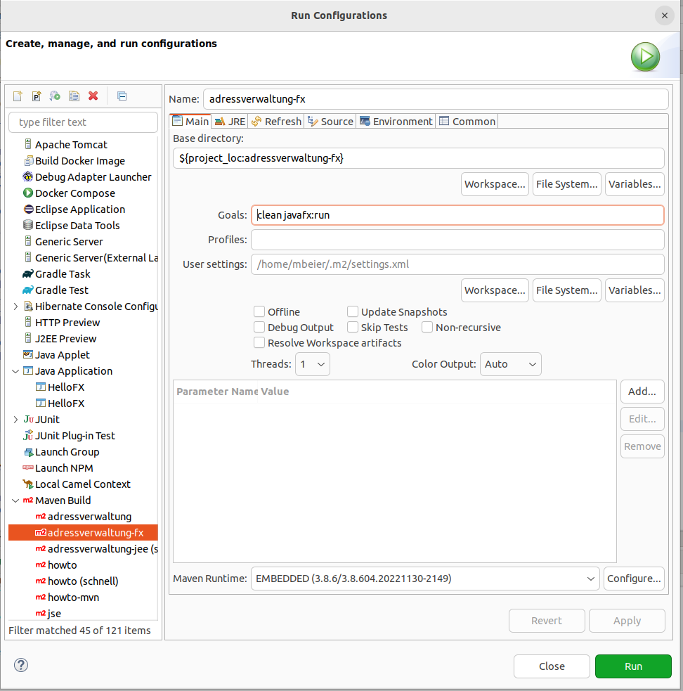
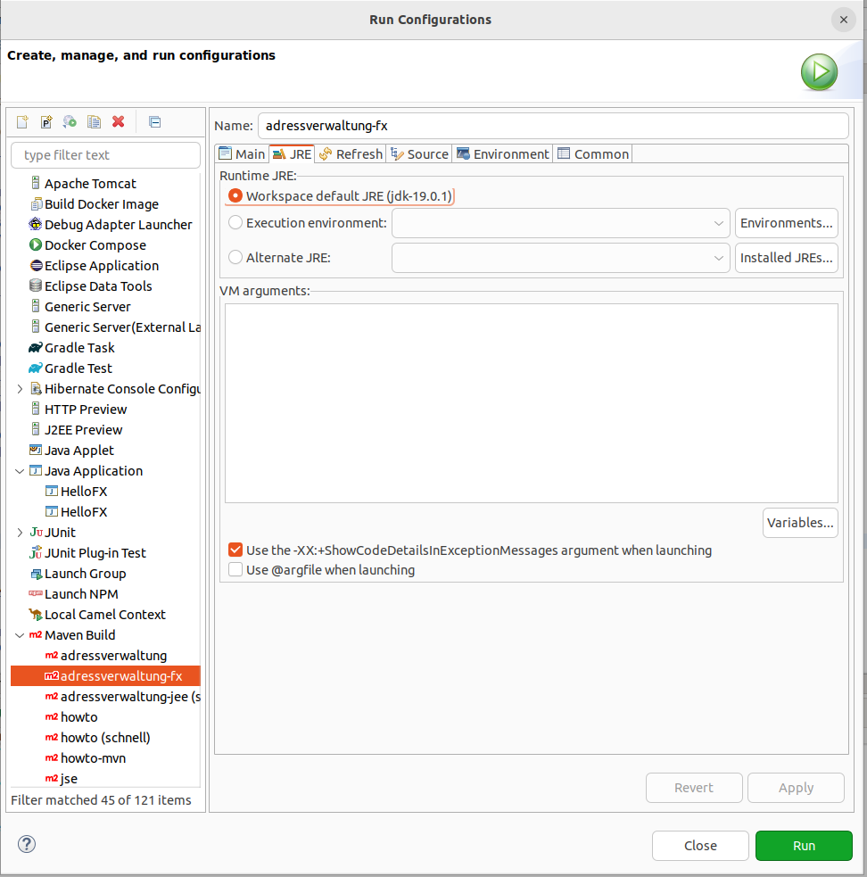

# Starten der Anwendung

Die <a href="https://openjfx.io/openjfx-docs/#maven">openjfx.io</a>
Beispielanwendung [HelloFX](src/main/java/com/github/mbeier1406/adressverwaltung/HelloFX.java)
kann auf zwei Arten gestartet werden:

## Eclipse Run Configuration

Voraussetzung ist, dass das JavaFX SDK heruntergeladen wurde. Siehe hierzu das
<a href="https://github.com/mbeier1406/JavaFX">JavaFX README</a>. Die Datei
[HelloFX.launch](etc/HelloFX.launch) zeigt die Konfiguration
des Launchers.

## Maven

Mit dem <code>org.openjfx.javafx-maven-plugin</code> Plugin kann über das Goal <code>javafx:run</code>
die Anwendung gestartet werden (Konfiguration in der [pom.xml](pom.xml)).
Die Konfiguration der Java-Version in der Umgebung ist Voraussetzung:

Die Konfiguration des Goal:

Die Konfiguration des JRE:

